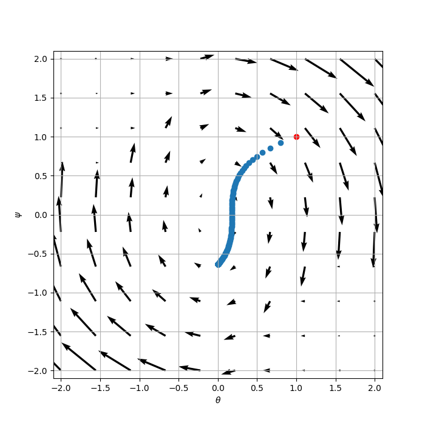

# Dirac-GAN

This repository is based on [ChristophReich1996/Dirac-GAN](https://github.com/ChristophReich1996/Dirac-GAN) which implements (PyTorch) the Dirac-GAN proposed in the paper "Which Training Methods for GANs do actually Converge?" by [Mescheder et al. [1]](https://github.com/LMescheder). The modification is made to incorporate the MCGAN algorithm into the code base. Specifically, two classes named MCGANLossGenerator and  MCGANLossDiscriminator are added to [`dirac_gan/loss.py`](https://github.com/Baoren1996/MCGAN_Img/blob/main/Toy_example_DiracGAN/dirac_gan/loss.py). And a new argument named MC is added to [`class ModelWrapper`](https://github.com/Baoren1996/MCGAN_Img/blob/main/Toy_example_DiracGAN/dirac_gan/model_wrapper.py) to control the usage of MC method. 

<table>
  <tr>
    <td> Standard GAN loss </td>
    <td> Non-saturating GAN loss </td>
    <td> Wasserstein GAN </td>
  </tr> 
  <tr>
    <td> </td>
    <td> </td>
    <td> </td>
  </tr> 
  <tr>
    <td> Monte Carlo GAN </td>
    <td> Least squares GAN </td>
    <td> Hinge GAN </td>
  </tr> 
  <tr>
    <td> </td>
    <td> </td>
    <td> </td>
  </tr>
</table>

This repository implements the following GAN losses and regularizers.

| Method | Discriminator loss | Generator loss |
| :--- | :--- | :--- |
| Original GAN loss | $`\mathcal{L}^{\text{GAN}}_{D}=-\mathbb{E}_{x\sim p_{d}}[\log(D(x))] - \mathbb{E}_{\hat{x}\sim p_{g}}[\log(1 - D(\hat{x}))]`$ | $`\mathcal{L}_{G}^{\text{GAN}}=\mathbb{E}_{\hat{x}\sim p_{g}}[\log(1 - D(\hat{x}))]`$ |
| Non-saturating GAN loss | $`\mathcal{L}_{D}^{\text{NSGAN}}=-\mathbb{E}_{x\sim p_{d}}[\log(D(x))] - \mathbb{E}_{\hat{x}\sim p_{g}}[\log(1 - D(\hat{x}))]`$ | $`\mathcal{L}_{G}^{\text{NSGAN}}=-\mathbb{E}_{\hat{x}\sim p_{g}}[\log(D(\hat{x}))]`$ |
| Wasserstein GAN loss | $`\mathcal{L}_{D}^{\text{WGAN}}=-\mathbb{E}_{x\sim p_{d}}[D(x)] %2B \mathbb{E}_{\hat{x}\sim p_{g}}[D(\hat{x})]`$ | $`\mathcal{L}_{G}^{\text{WGAN}}=-\mathbb{E}_{\hat{x}\sim p_{g}}[D(\hat{x})]`$|
| Wasserstein GAN loss + grad. pen. | $`\mathcal{L}_{D}^{\text{WGANGP}}=\mathcal{L}_{D}^{\text{WGAN}} %2B \lambda\mathbb{E}_{\hat{x}\sim p_{g}}[(\lvert\lvert\nabla D(\alpha x %2B (1 - \alpha \hat{x}))\rvert\rvert_{2} - 1)^2]`$ | $`\mathcal{L}_{G}^{\text{WGANGP}}=\mathcal{L}_{G}^{\text{WGAN}}`$ |
| Least squares GAN loss | $`\mathcal{L}^{\text{LSGAN}}_{D}=-\mathbb{E}_{x\sim p_{d}}[(D(x) - 1)^2] %2B \mathbb{E}_{\hat{x}\sim p_{g}}[D(\hat{x})^2]`$| $`\mathcal{L}^{\text{LSGAN}}_{G}=-\mathbb{E}_{\hat{x}\sim p_{g}}[(D(\hat{x} - 1))^2]`$ |
| Hinge GAN |$`\mathcal{L}^{\text{LSGAN}}_{D}=-\mathbb{E}_{x\sim p_{d}}[\min(0, D(x)-1] - \mathbb{E}_{\hat{x}\sim p_{g}}[\min(0, -D(\hat{x})-1)]`$ | $`\mathcal{L}^{\text{LSGAN}}_{G}=\mathcal{L}^{\text{WGAN}}_{G}`$ |
| DRAGAN | $`\mathcal{L}_{D}^{\text{DRAGAN}}=\mathcal{L}_{D}^{\text{GAN}} %2B \lambda\mathbb{E}_{\hat{x}\sim p_{d} %2B \mathcal{N}(0, c)}[(\lvert\lvert\nabla D(\hat{x})\rvert\rvert_{2} - 1)^2]`$ | $`\mathcal{L}_{G}^{\text{DRAGAN}}=\mathcal{L}_{G}^{\text{GAN}}`$ |
| MCGAN | $`\mathcal{L}_{D}^{\text{MCGAN}}=\mathcal{L}_{D}^{\text{GAN}}`$|  $`\mathcal{L}_{G}^{\text{MCGAN}}=\mathbb{E}_{x\sim p_{d}}[\|D(x) - \mathbb{E}_{\hat{x}\sim p_{g}}[D(\hat{x})]\|^2]`$ |

| Method | Penalty term |
| :--- | :--- |
| $`R_{1}`$ regularization | $`R_{1}=\frac{\gamma}{2}\mathbb{E}_{x\sim p_{d}}[\lvert\lvert\nabla D(x)\rvert\rvert^2]`$ |
| $`R_{2}`$ regularization | $`R_{2}=\frac{\gamma}{2}\mathbb{E}_{\hat{x}\sim p_{g}}[\lvert\lvert\nabla D(x)\rvert\rvert^2]`$ |
| $`R_{\text{LC}}`$ regularization | $`R_{\text{LC}}=\mathbb{E}_{x\sim p_{d}}[\lvert\lvert D(x) - \alpha_{F}\rvert\rvert^{2}] %2B \mathbb{E}_{\hat{x}\sim p_{g}}[\lvert\lvert D(G(\hat{x})) - \alpha_{R}\rvert\rvert^{2}]`$ |

## Dependencies

Dirac-GAN is written in [PyTorch 1.8.1](https://pytorch.org/). No GPU is required! All additional dependencies can be seen in the [`requirements.txt`](requirements.txt) file. To install all dependencies simply run:

```shellscript
pip install -r requirements.txt
```

[Older version of PyTorch](https://pytorch.org/get-started/previous-versions/) may also allows running the code without issues.

## Usage

The implementation provides a simple GUI to run all Dirac-GAN experiments with different settings. Simply run:

```shell script
python main.py
```

Set the desired parameters in the GUI and click on "Run training" to perform training. This could take a few seconds. If the training
is finished all results are plotted and shown.

## References

```bibtex
[1] @inproceedings{Mescheder2018,
    title={Which training methods for GANs do actually converge?},
    author={Mescheder, Lars and Geiger, Andreas and Nowozin, Sebastian},
    booktitle={International conference on machine learning},
    pages={3481--3490},
    year={2018},
    organization={PMLR}
}
```
